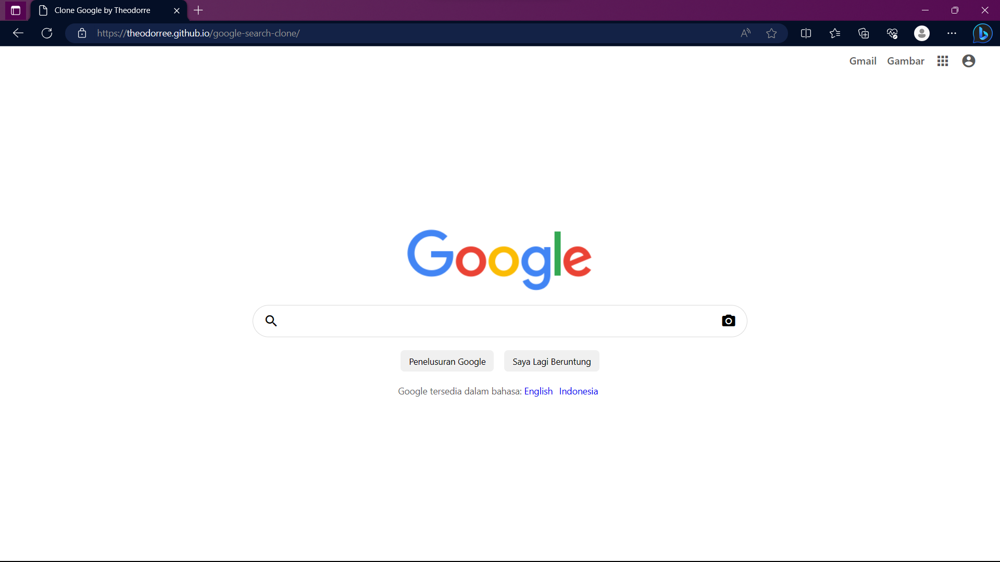

# Google Search Clone

## Description

Google Search Clone is a web application that replicates the basic functionality of the Google search engine. The project is built using HTML, CSS, and JavaScript. It allows users to perform searches for keywords or phrases and displays search results with relevant titles, URLs, and descriptions. The search results are paginated to enable easy navigation, and a custom search algorithm is implemented to provide relevant and accurate results.

## Features

- Search for keywords or phrases.
- Display search results with relevant titles, URLs, and descriptions.
- Pagination to navigate through search results.
- Custom search algorithm to provide relevant results.

## Technologies Used

- HTML
- CSS
- JavaScript

## Demo

You can see a live demo of the project [here](https://theodorree.github.io/google-search-clone/)

## Usage
- Access the application by opening the  file in your web browser.index.html
- Enter your search query in the search box.
- Press Enter or click the "Penelusuran Google" button.
- The search results will be displayed on the page.
- Click on a search result to visit the corresponding URL.
- Contributing
- Contributions are welcome! If you'd like to contribute to this project, please follow these steps:
